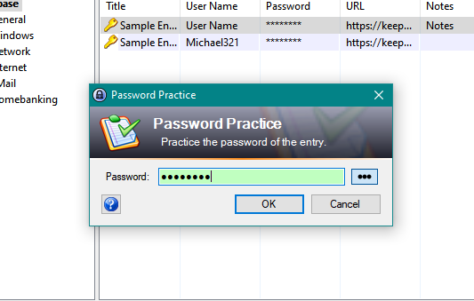

KeePassPasswordPractice
=======================

Overview
--------

KeePassPasswordPractice is a plug-in for KeePass 2.x which lets you practice the password of a field in order to memorize it.

This plugin is created by modifying [KeePassTimestampChanger](https://github.com/KN4CK3R/KeePassTimestampChanger).

Installation
------------

- Download from https://github.com/Shayan-To/KeePassPasswordPractice/releases
- Copy the plug-in (KeePassPasswordPractice.plgx) into the KeePass plugin directory
- Start KeePass (and open a database)

How to use
----------

The KeePassPasswordPractice plugin integrates itself into the entry context menu of KeePass.
Just select one entry and click "Practice password..." (or press `Ctrl+\`).
There is a new context menu on the history tab too.

This plugin makes no changes to any of the entris or the database (hopefully).

You can click the peek button (or press `F1`) to peek at the password.
Also, while on the password box, press `F2` (or click the button) to use asterisks to show/hide the password.

License
-------

MIT
